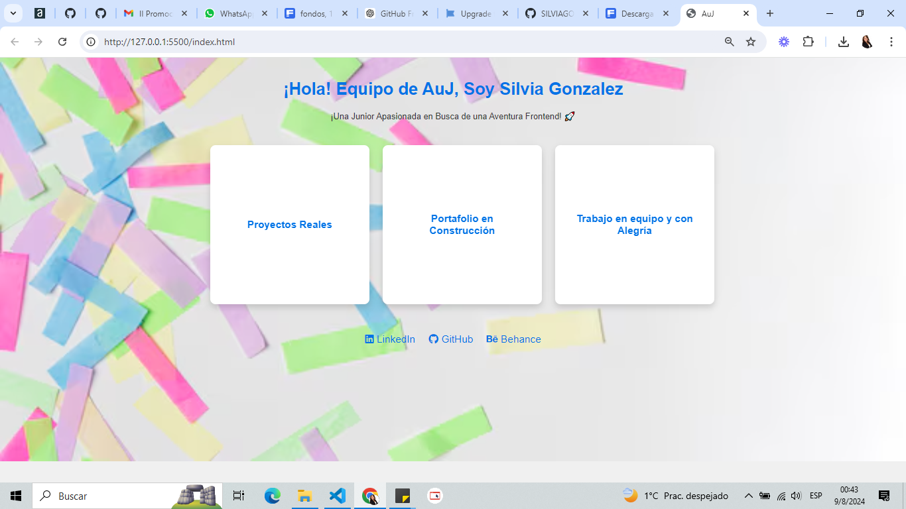

# II-Promocion-GruposTrabajo-AuJ-Frontend

¡Hola! 🚀

Soy Silvia Gonzalez, una entusiasta del desarrollo Frontend con mucho entusiasmo por aprender y contribuir a proyectos reales. Este repositorio es parte de mi aplicación para el programa "Adopta un Junior", donde espero unirme a un equipo y aportar mis habilidades mientras continúo aprendiendo y creciendo como desarrolladora.

## ¿Por qué quiero formar parte de los grupos de trabajo de Frontend?

Aquí te presento tres razones principales:

1. **Proyectos Reales, ¡Por Favor!**  
   Quiero aplicar mis conocimientos en proyectos reales y ver cómo mi código se convierte en algo tangible. Mi lema es "Transformar ideas en interfaces". 

2. **Portafolio en Construcción**  
   Busco construir un portafolio impresionante que no solo muestre mi habilidad para hacer que los botones funcionen, sino también mi capacidad para hacer que la experiencia del usuario sea increíble.

3. **Contribución con Alegría**  
   Estoy emocionada por contribuir y aprender en un entorno dinámico, ¡y prometo hacerlo con una sonrisa y un toque de creatividad!

## Cómo Clonar Este Repositorio
a. Clona el repositorio a tu máquina local:
Copiar código
git clone https://github.com/SILVIAGONZALEZ1/II-Promocion-GruposTrabajo-AuJ-Frontend.git

b. Navega al directorio del proyecto:
Copiar código
cd adopta-un-junior

c. Abre index.html en tu navegador para ver el proyecto en acción.

Contribuciones
¡Estoy emocionada por contribuir y aprender en este programa! Si tienes comentarios o sugerencias, no dudes en contactarme a través de mis redes profesionales.

¡Gracias por tu tiempo y consideración!

Saludos,
Silvia Gonzalez 🚀

